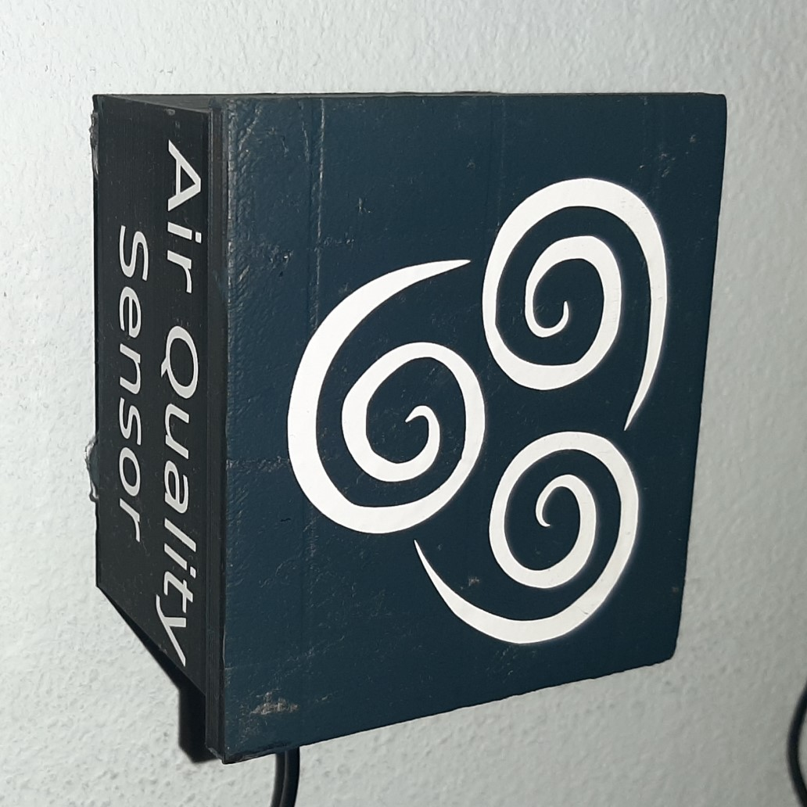
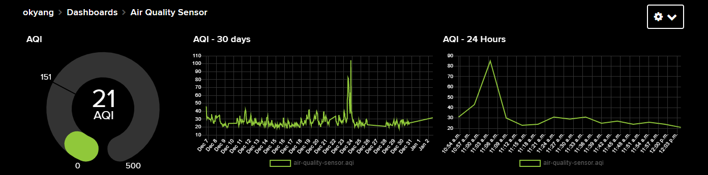
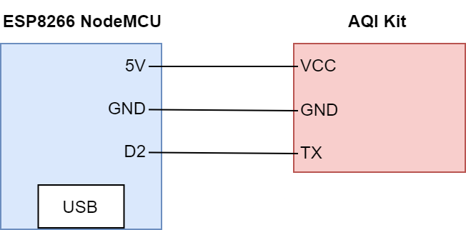
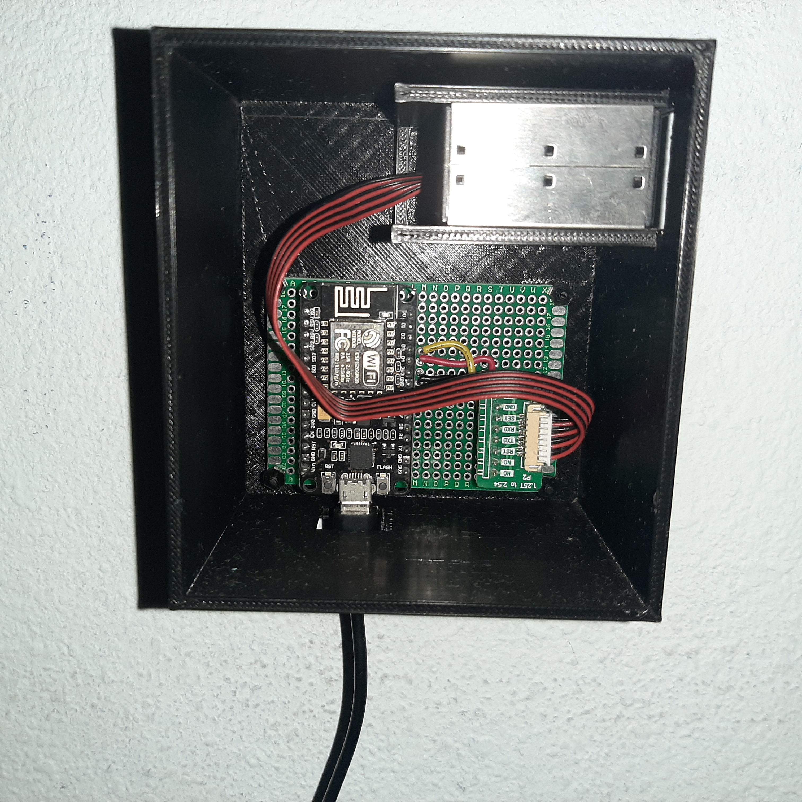

# AQI Monitoring with Adafruit IO

Air Quality Index (AQI) uses pollutants such as Particulate Matter 2.5 microns (PM2.5) to indicate air quality. I will be using [Adafruit IO](https://io.adafruit.com/) and the [PM2.5 Air Quality Sensor and Breadboard Adapter Kit - PMS5003](https://www.adafruit.com/product/3686).





## Prerequisites
- Git
- [Arduino IDE](https://www.arduino.cc/)
- [ESP8266 Library Setup](https://randomnerdtutorials.com/how-to-install-esp8266-board-arduino-ide/)
- [Adafruit IO Account](https://io.adafruit.com/)
- Soldering Skills

## 🧻 Materials

- [PM2.5 Air Quality Sensor and Breadboard Adapter Kit - PMS5003](https://www.adafruit.com/product/3686)
- Prototyping Board
- (Optional) Female Header Pins
- Solder
- 4 x M2.5 6mm Stand-offs
- 5 x M2.5 Nuts
- Micro-USB Cable
- USB 5V Charger Adapter

## 🔬 Equipment

- 3D Printer
- Soldering Iron
- Helping Hands
- Laptop/Computer

## 🥾 Steps

### 1 - Print Case
1. Print the following (refer to print settings below)
    1. [AQI Sensor Case](./stl/AQI_Case.stl)
    2. [AQI Sensor Case Cap](./stl/AQI_Case_Cap.stl)


Below were just my print settings. Feel free to modify as you see fit.

| Setting | Value |
| --------| ----- |
| Layer height (mm) | 0.1 |
| Shell thickness (mm) | 0.8 |
| Bottom/Top thickness (mm) | 1.5 |
| Fill Density (%) | 15 |
| Print speed (mm/s) | 50 |
| Support type | Everywhere |
| Platform adhesion type | None |

### 2 - Solder Electronics

1. Refer to the circuit diagram below to solder your prototyping board
2. (Optional) instead of soldering the ESP8266 and the AQI Adapter Kit onto the bread board I like to solder some female header pin sockets. That way I can just plug and unplug those boards in case I want to repurpose them.

    
3. This is what my soldering circuit looks like

    

### 3 - Setup Adafruit IO Feeds

1. Go to [Adafruit IO](https://io.adafruit.com/)
2. [Create a new feed](https://io.adafruit.com/https://io.adafruit.com/) for Air Quality Index (AQI)
3. Take note of:
    1. Adafruit IO Username
    1. Adafruit IO Key
    1. Adafruit IO Feedname

### 4 - Upload the Code

1. Clone the repo (or download the repo): `git clone https://github.com/okyang/tinyOkayProjects.git`
1. Open the folder `AQI_monitoring_adafruitio/AQI_adaIO`
2. Copy the file `config_template.h` into a new file called `config.h`
3. Replace the config file definitions
    ```c
    #define IO_USERNAME   "<your_username>"
    #define IO_KEY        "<your_key_here>"
    #define FEEDNAME      "<your_feedname_here>"

    // wifi
    #define WIFI_SSID     "<your_wifi_ssd_here>"
    #define WIFI_PASS     "<your_wifi_password_here>"
    ```
4. Open up the file `AQI_monitoring_adafruitio/AQI_adaIO/AQI_adaIO.ino` in the Arduino IDE
5. Plug in your ESP8266 NodeMCU to your computer
6. Compile and Upload the code to your ESP8266 NodeMCU

### 5 - Assemble and Start Collecting Data

1. Screw in your Prototyping Board with standoffs
2. Connect the AQI Sensor to the protoyping board
3. Plug in your USB cable to the ESP8266 NodeMCU and the SB 5V Charger Adapter to your wall socket
4. It should start uploading the readings to Adafruit IO 🎉
5. You can view the data in your feed