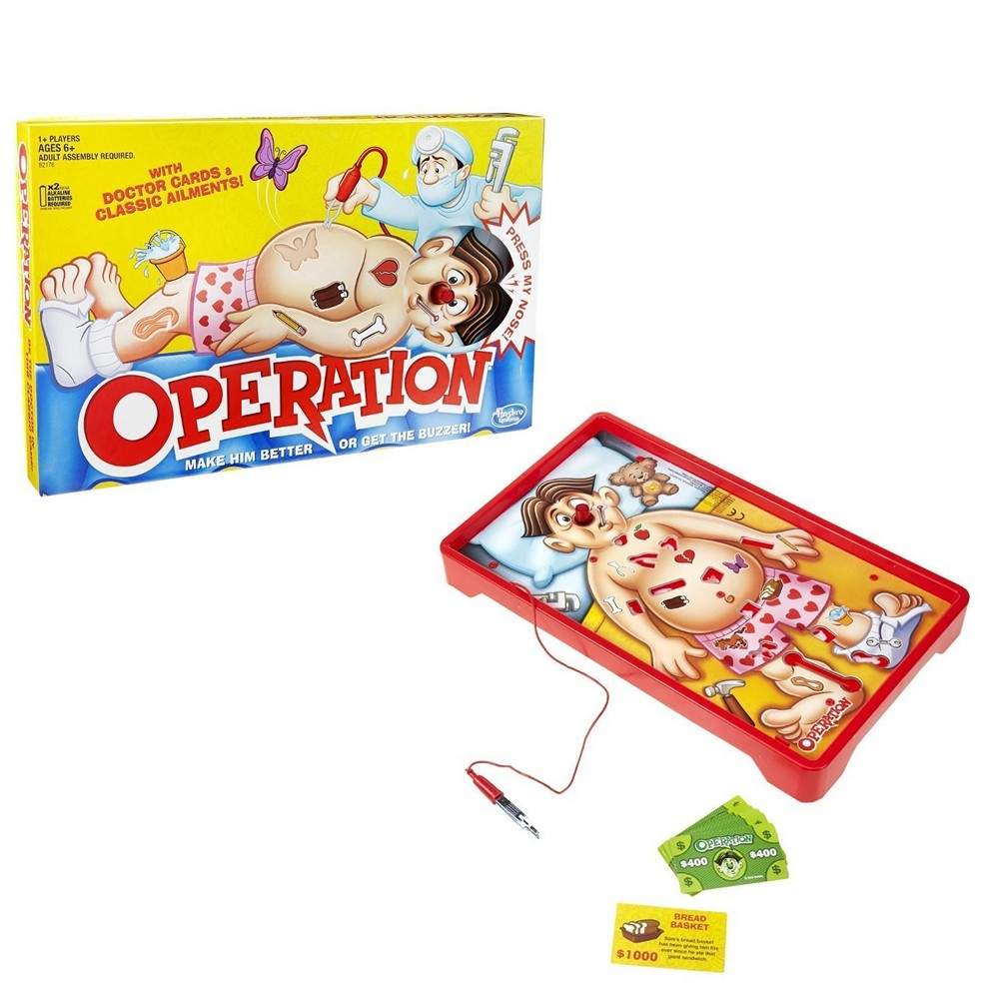

# Operation Game

I was watching a YouTube [video](https://www.youtube.com/watch?v=Kml6bc-URu4) about Allen Pan from Sufficiently Advanced, building the game operation with it twist. It shocks you every-time you mess up. I thought it would be fun to build my own version of it, so here we go.


## Prerequisites
- [Arduino IDE](https://www.arduino.cc/)
- Soldering Skills

## 🧻 Materials
- [TENS unit](https://www.amazon.com/gp/product/B00NCRE4GO/ref=ppx_yo_dt_b_search_asin_title?ie=UTF8&psc=1)
- [Copper Tape](https://www.amazon.com/gp/product/B0741ZRP4W/ref=ppx_yo_dt_b_search_asin_title?ie=UTF8&psc=1)
- Stranded Core Wires
- [Metal tweezers](https://www.amazon.com/gp/product/B081GX7NPT/ref=ox_sc_saved_title_2?smid=A2OK7U9CYR0DGE&psc=1)
- Cardboard
- Filament for 3D Printer
- [Arduino Nano](https://www.amazon.com/ELEGOO-Arduino-ATmega328P-Without-Compatible/dp/B0713XK923?ref_=ast_sto_dp&th=1&psc=1)
- Cardboard
- Paint
- Solder

## 🔬 Equipment
- 3D Printer
- Scissors
- Box Cutter
- Paint Brushes
- Soldering Iron
- Hot Glue

## How it works

Operation is very common board game where a player performs "operation" using a metal tweezer to try to take out objects from a cardboard cutout of a person (see image below). However, if your tweezer touches the board, you lose!



In Allen Pan's [video](https://www.youtube.com/watch?v=Kml6bc-URu4), he added his own twist to the game by including a TENS unit. This TENS unit would "shock" or electrically stimulate your muscle if your tweezers touches the board. I was inspired by that video to try to make my own version of it. It was a lot of fun making it and even more fun to play with friends. I think it also has a great team bonding aspect to it because if one person messes up, the other person who is hooked up to the TENS unit also gets shocked!

## Steps

### ⚡ Building the Circuit

### 💻 Coding
1. Open up your Arduino IDE.
2. Open up `operation_game/shock_operation/shock_operation.ino` or just copy the code from it
3. Make sure it compiles. It should compile. If it doesn't, please submit a bug report.
4. Connect your Arduino Nano
5. Select the Arduino Nano Board
6. Upload the code to the Arduino Nano

The code logic is represented in the flow chart below:


Source code for [flowchart.js](https://flowchart.js.org/):
```flow
st=>start: Start
op1=>operation: Setup Pins
op2=>operation: Super Loop
cond=>condition: Is the circuit connected?

op_close1=>operation: Activate Relays for 2 seconds
op_close2=>operation: Turn off relays for 1 second

op_open1=>operation: Turn off Relays

e=>end

st->op1->op2->cond
cond(yes)->op_close1->op_close2->op2
cond(no)->op_open1->op2
```

### 🖨 3D Printing and Setting up the Game Pieces

All game pieces are located in the folder `operation_game/game_pieces`.

1. Print out all `*.stl` files on a 3D printer.
    1. I used 15% infill
2. Tape copper tape around all the edges of the lip pieces (`*lip.stl` files)
3. Tape copper tape around

All `*.svg` files are the 2D drawings of each game piece. You can use these files to modify

### 🎮 Assembling the Game Board

1. Hot Glue 2 pieces of cardboard together and draw your patient
2. In my case I have Panda Bear from We Bare Bears
3. Trace out cutouts with a pencil using the lip pieces (`*lip.stl` files)
    1. make sure you trace the inside of the lip and not the outside. That way you can hot glue your lip pieces to the board
4. Cut out your traces using a box cuter
5. Hot glue the lip pieces to the cutouts you just made
6. Connect copper tape from all the lip pieces to the bottom right corner of the board
7. Solder together the joints of the copper tape
9. Solder a stranded wire (about 12" is a good amount) to the bottom right corner of the board
10. (Optional) Using a multimeter, use the continuity test to check that everything is connected to each other

### 🔨 Putting it All Together
