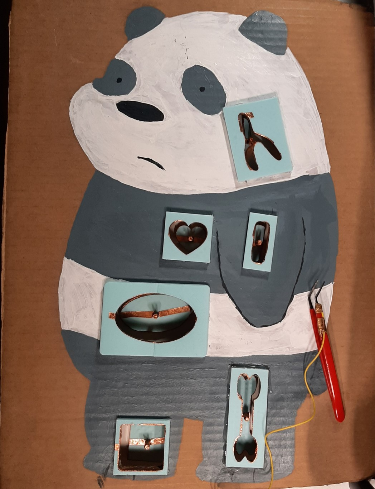
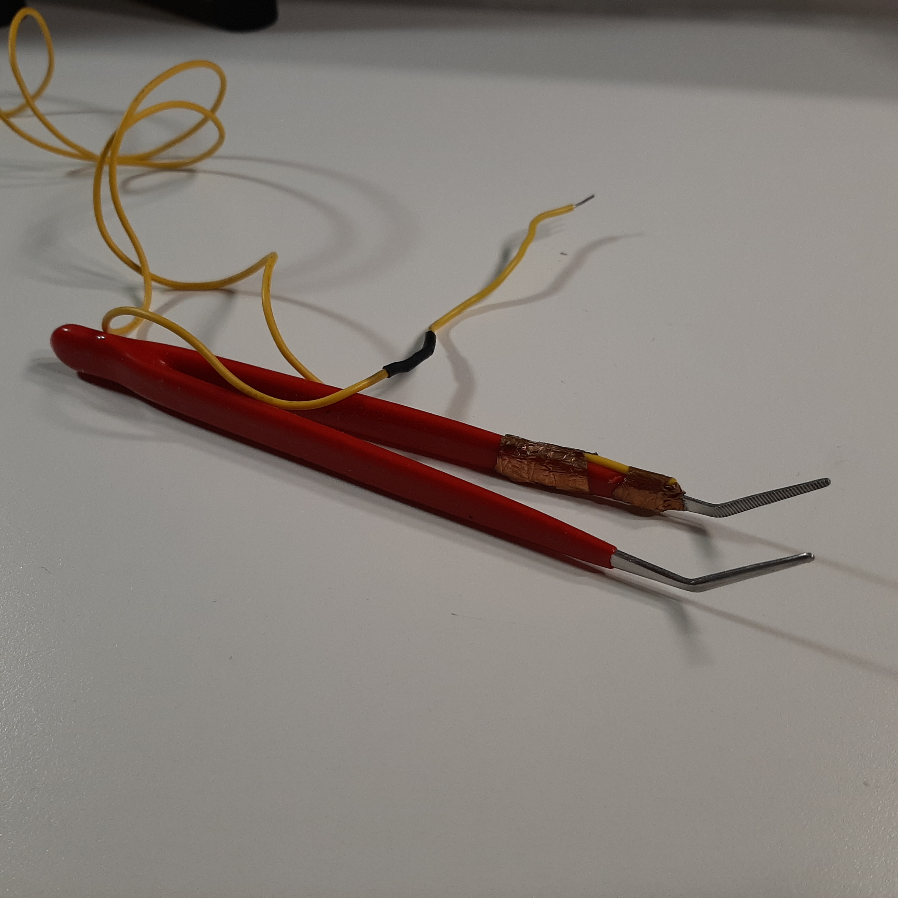
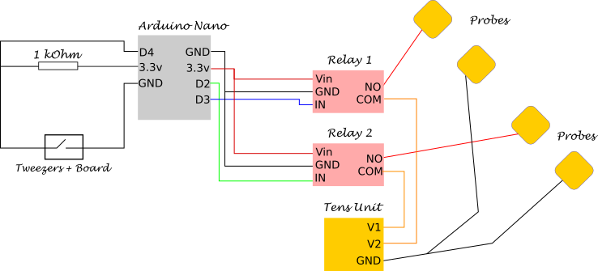
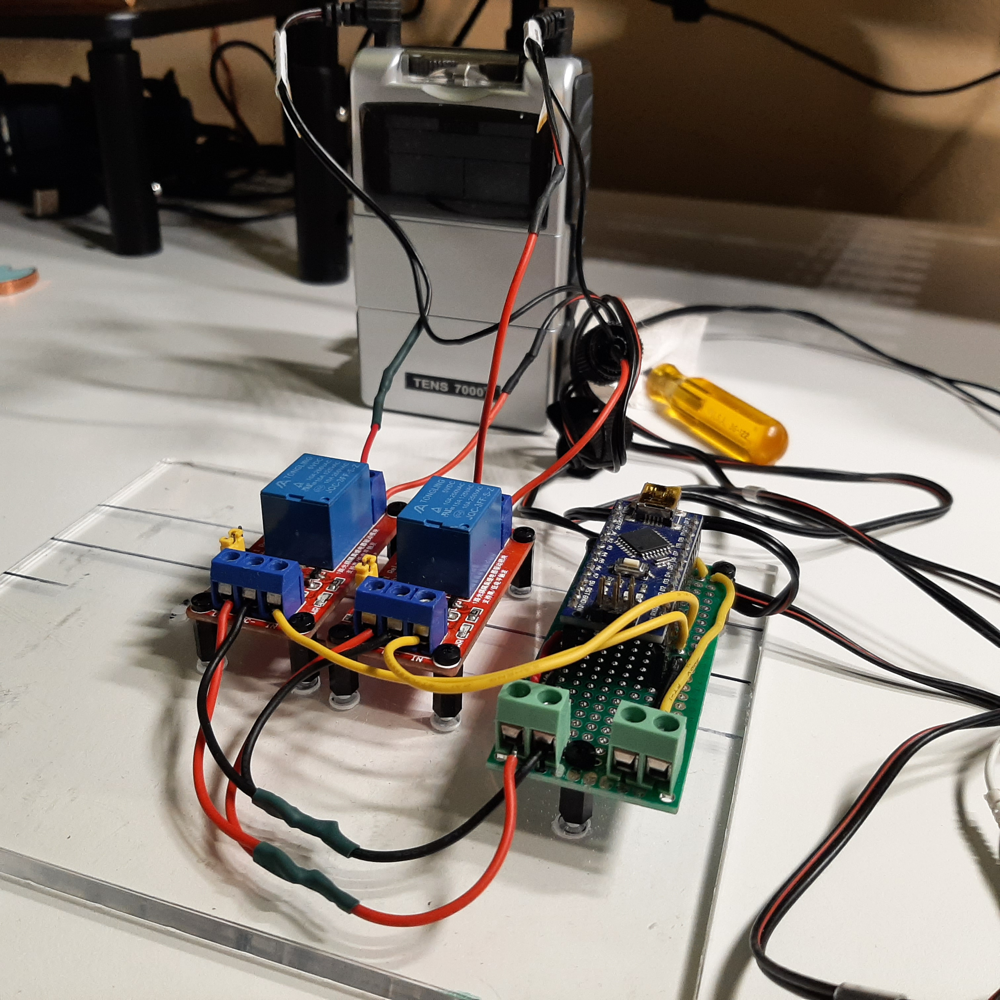
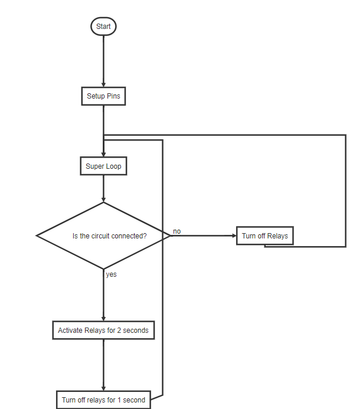
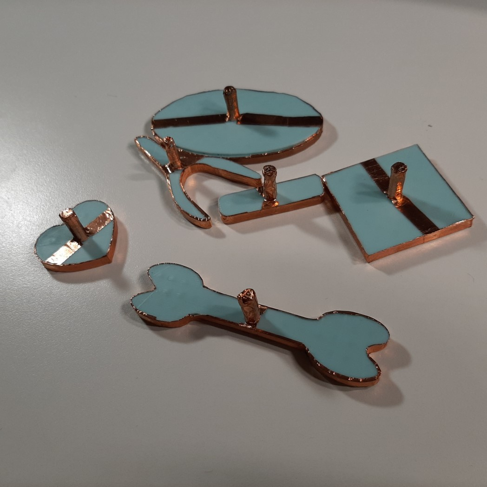
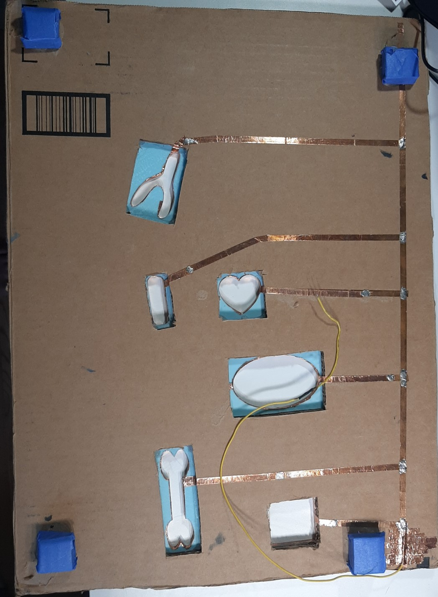

# Operation Game
*IMPORTANT NOTE: Please be safe and responsible. Follow proper instructions of the TENS unit. Everything you do is at your own risk and I am not responsible.*

I was watching a YouTube [video](https://www.youtube.com/watch?v=Kml6bc-URu4) about Allen Pan from Sufficiently Advanced, building the game operation with it twist. It shocks you every-time you mess up. I thought it would be fun to build my own version of it, so here we go.



*Drawing Credit goes to Jonathan Chen*

* [Prerequisites](#prerequisites)
* [🧻 Materials](#-materials)
* [🔬 Equipment](#-equipment)
* [How it works](#how-it-works)
* [Steps](#steps)
    + [🎮 Assembling the Game Board](#-assembling-the-game-board)
    + [🛠 Making the Tweezers](#-making-the-tweezers)
    + [⚡ Building the Circuit](#-building-the-circuit)
    + [💻 Coding](#-coding)
    + [🖨 3D Printing and Setting up the Game Pieces](#---3d-printing-and-setting-up-the-game-pieces)
    + [🔨 Putting it All Together](#---putting-it-all-together)
    + [Let's Play](#let-s-play)

## Prerequisites
- [Arduino IDE](https://www.arduino.cc/)
- Soldering Skills

## 🧻 Materials
- [TENS unit](https://www.amazon.com/gp/product/B00NCRE4GO/ref=ppx_yo_dt_b_search_asin_title?ie=UTF8&psc=1)
- [Copper Tape](https://www.amazon.com/gp/product/B0741ZRP4W/ref=ppx_yo_dt_b_search_asin_title?ie=UTF8&psc=1)
- Stranded Core Wires
- [Metal tweezers](https://www.amazon.com/gp/product/B081GX7NPT/ref=ox_sc_saved_title_2?smid=A2OK7U9CYR0DGE&psc=1)
- Cardboard
- Filament for 3D Printer
- [Arduino Nano](https://www.amazon.com/ELEGOO-Arduino-ATmega328P-Without-Compatible/dp/B0713XK923?ref_=ast_sto_dp&th=1&psc=1)
- Cardboard
- Paint
- Solder

## 🔬 Equipment
- 3D Printer
- Scissors
- Box Cutter
- Paint Brushes
- Soldering Iron
- Hot Glue

## How it works

Operation is very common board game where a player performs "operation" using a metal tweezer to try to take out objects from a cardboard cutout of a person (see image below). However, if your tweezer touches the board, you lose!


In Allen Pan's [video](https://www.youtube.com/watch?v=Kml6bc-URu4), he added his own twist to the game by including a TENS unit. This TENS unit would "shock" or electrically stimulate your muscle if your tweezers touches the board. I was inspired by that video to try to make my own version of it. It was a lot of fun making it and even more fun to play with friends. I think it also has a great team bonding aspect to it because if one person messes up, the other person who is hooked up to the TENS unit also gets shocked!

## Steps

### 🎮 Assembling the Game Board

1. Hot Glue 2 pieces of cardboard together and draw your patient 👨‍⚕️
    1. In my case I have Panda Bear from We Bare Bears 🐼
2. Trace out cutout holes with a pencil using the inside of the lip pieces (`*lip.stl` files)
    1. make sure you trace the inside of the lip and not the outside. That way you can hot glue your lip pieces to the board
3. Cut out your traces using a box cuter
4. Hot glue the lip pieces to the cutouts you just made
5. Connect copper tape from all the lip pieces to the bottom right corner of the board
6. Solder together the joints of the copper tape
7. Solder a stranded wire (about 12" is a good amount) to the bottom right corner of the board
8. (Optional) Using a multimeter, use the continuity test to check that everything is connected to each other

### 🛠 Making the Tweezers
1. Strip some stranded wire so that the exposed wires can wrap around part of the tweezers
2. Copper tape the exposed stranded wire in place on the tweezers
3. Strip the other end of the wire and cover it with a small amount of solder (this will be connected to the circuit)



### ⚡ Building the Circuit

Here is the schematic for the game. It consists of 3 basic components:
1. The Arduino Nano, which is the brains of this operation.
2. The board + tweezers that will act as a switch. If the tweezers touch a part of the board it will close the connection and complete the circuit.
3. The relays which will allow the TENS unit to shock the players.





To build the circuit follow these steps:
1. Solder together the circuit in the circuit diagram for the Tweezers, board, and the Arduino Nano
2. Connect wires from the Arduino Nano to the Relays as shown in the circuit diagram
3. Splice the Tens unit probe red wires so that it can connect to the relays as shown in the circuit diagram

### 💻 Coding
1. Open up your Arduino IDE.
2. Open up `operation_game/shock_operation/shock_operation.ino` or just copy the code from it
3. Make sure it compiles. It should compile. If it doesn't, please submit a bug report.
4. Connect your Arduino Nano
5. Select the Arduino Nano Board in your IDE editor. Make sure you also select the correct port number!
6. Upload the code to the Arduino Nano

*If you don't understand these instructions above, perhaps more background on Arduino IDE may help. Visit [Arduino Software IDE Guide](https://www.arduino.cc/en/Guide/Environment#writing-sketches).*

The code logic is represented in the flow chart below:



Source code for [flowchart.js](https://flowchart.js.org/):
```flow
st=>start: Start
op1=>operation: Setup Pins
op2=>operation: Super Loop
cond=>condition: Is the circuit connected?

op_close1=>operation: Activate Relays for 2 seconds
op_close2=>operation: Turn off relays for 1 second

op_open1=>operation: Turn off Relays

e=>end

st->op1->op2->cond
cond(yes)->op_close1->op_close2->op2
cond(no)->op_open1->op2
```

### 🖨 3D Printing and Setting up the Game Pieces

All game pieces are located in the folder `operation_game/game_pieces`.

1. Print out all `*.stl` files on a 3D printer.
    1. I used 15% infill
2. Tape copper tape around all the inner edges of the lip pieces (`*lip.stl` files)
3. Tape copper tape around all the outer edges of the game pieces



All `*.svg` files are the 2D drawings of each game piece. You can use these files to modify

### 🔨 Putting it All Together

1. Hot glue all the lip pieces to the Board

2. Copper tape the lip pieces conductive edges, creating a path to the bottom right corner of the board, where all the connections should connect to the wire.



3. Connect the wire to the circuit


### Let's Play
1. Hook up the TENS unit to one arm
2. Setup the game pieces in the holes
3. Power on your Arduino
4. Start playing by using the tweezers to pick out the game pieces
5. Don't get shocked! 🙂
