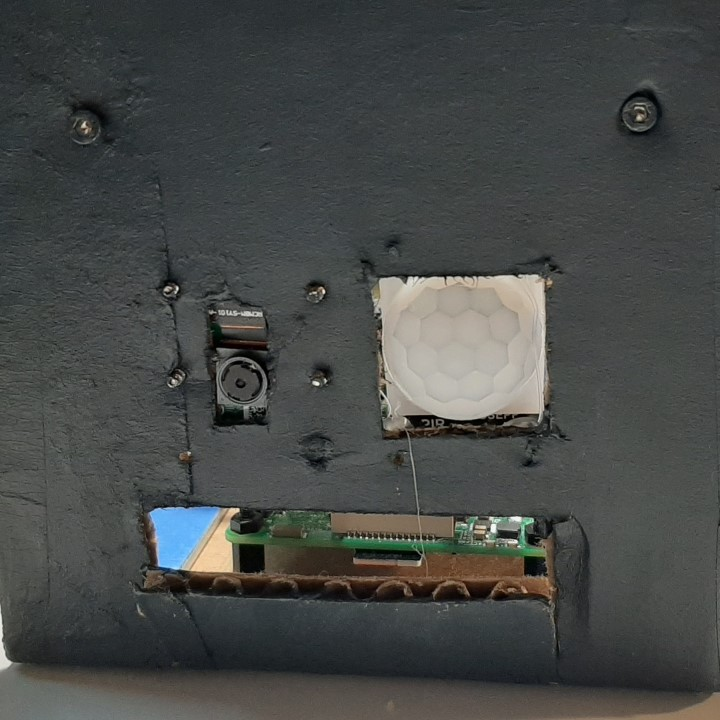
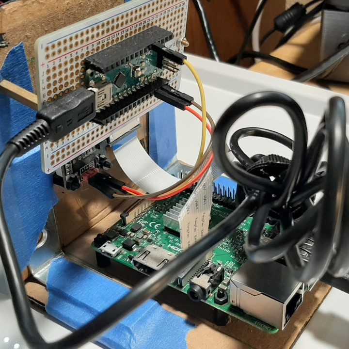

# Motion Activated Raspberry Pi Camera :camera: (with PIR and Nanpy)

This project records videos whenever there is any motion detected. This could be used as a security camera for your snacks, a backyard wildlife monitor, and more. My Raspberry Pi had some issues with its GPIO pins and I also learned that some specific sensors do not work well with the Pi. So I decided this was the perfect opportunity to also learn how to use Nanpy, which allows the Raspberry Pi to use an Arduino's GPIO pins.


*Figure 1. Demo of recording after PIR detects motion from my fingers*

## Materials
- Raspberry Pi 3 B+
- Arduino Nano
- Raspberry Pi Camera v2
- PIR Motion Sensor
- USB Drive (Optional)
- Jumper Wires

## How it works

We will use a PIR motion sensor that is connected to the Arduino Nano via its GPIO pins. The Arduino Nano will serve as a "slave" unit (unfortunately, that's just the term used by nanPy and other electrical engineers) to the Raspberry Pi through serial communication. Through serial communication, the Raspberry Pi will know when the PIR sensor detects motion and trigger the Raspberry Pi Camera to start recording a video.

## Prerequisites
- Raspberry Pi Debian OS already setup on Raspberry Pi w/ internet connection
- Raspberry Pi Camera Attached to Pi and Camera Interfacing Option Enabled
- Basic understanding of using the command line
- Basic understanding of GPIO pins


## 1 - Wiring the Circuit

(*For this step make sure the power is off*)

 1. Using female to male jumper wires make the following PIR sensor to Arduino connections:
    - V+ <--> 5V
    - GND <--> GND
    - Signal <--> D2 (Digital Pin 2)

## 2 - Setup Software Dependencies

1. Power up the Pi and open the terminal
2. Clone this directory using: `git clone https://github.com/okyang/tinyOkayProjects.git`  or just download the code from [here](https://github.com/okyang/tinyOkayProjects.git)
3. Make sure to take a note of the path that specifies where your `pir_activated_cam` folder is. You can type the command `pwd` in the terminal. For me, my path was: `/home/pi/tinyOkayProjects/pir_activated_cam`
4. In the terminal, go to the `setup` folder of the repository. You can type the command `cd <YOURPATH>/pir_activated_cam/setup`. Replace `<YOURPATH>` with where you downloaded or cloned the "pir_activated_cam" folder.
5. Run `pac_setup.sh`
    1. Use the command: `./pac_setup.sh`
    2. During this step you will be prompted to enter the path of the folder.
       *This bash script will install xterminal, nanpy, and arduino. It will also setup dependent files that will allow you to run motion activated raspberry pi camera code on startup. To do this we use autostart (see resources below).*
1. Connect Arduino to Raspberry Pi and follow install instructions for Nanpy. [Nanpy Install Instructions](https://pypi.org/project/nanpy/#how-to-build-and-install)

## Setting location to save video Files

1. Open up `pir_activated_cam.py` with a editor such as IDLE or leafpad
2. Change the last line in "pir_activated_cam.py" with the directory of your choice. Mine was `/media/pi/OKAY`, so the line of code under `if __name__ == "__main__"` looks like
    ```python
    main(pir_pin=2,inactiveDuration=60,outdir="/media/pi/OKAY")
    ```
3. Reboot the Raspberry Pi
    1. After you reboot the xterminal should pop-up and start running the program. So it should be really easy to debug if you mess up on any of the steps because the xterminal will tell you what is wrong.
    1. Once your code successfully runs in the xterminal, a `0` will be printed if there is no signal from the PIR motion sensor and a `"started recording..."` will print out if there is motion detected.

## Code Flow Chart


*Figure 2.*

## Sample Setup
I made this really ugly setup with cardboard, standoffs, and paint. Definitely not pretty, but hopefully a good reference for how I put everything together or if you are just curious.




*Figure 4. (Top) Exterior view, (Bottom) Interior View*
## Resources
(Raspberry Pi Camera)
- https://projects.raspberrypi.org/en/projects/getting-started-with-picamera/6
- https://picamera.readthedocs.io/en/release-1.13/recipes1.html

(Raspberry Pi Autostart)
- https://learn.sparkfun.com/tutorials/how-to-run-a-raspberry-pi-program-on-startup/all#method-2-autostart

(Nanpy)
- https://pypi.org/project/nanpy/
- https://www.youtube.com/watch?v=QumIhvYtRKQ
